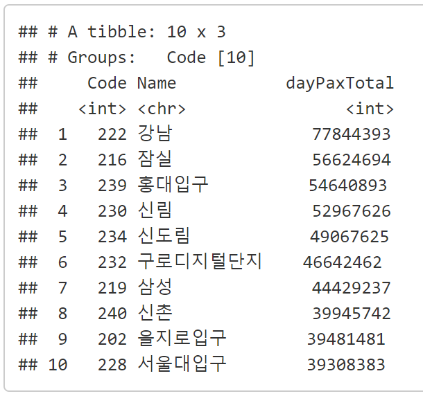
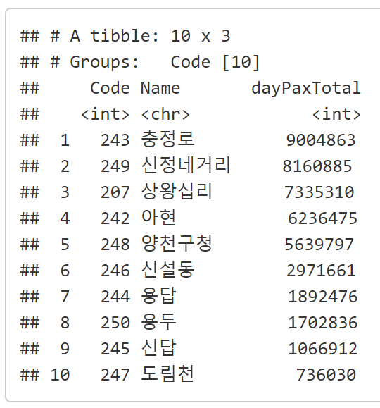
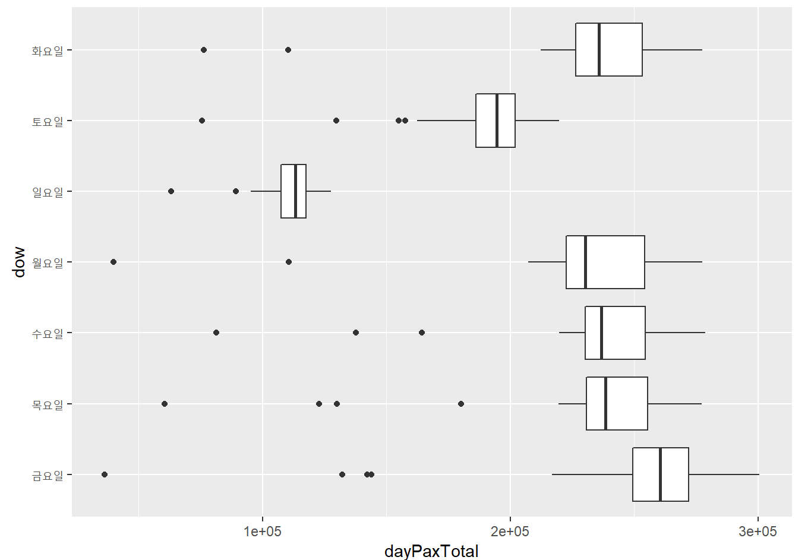
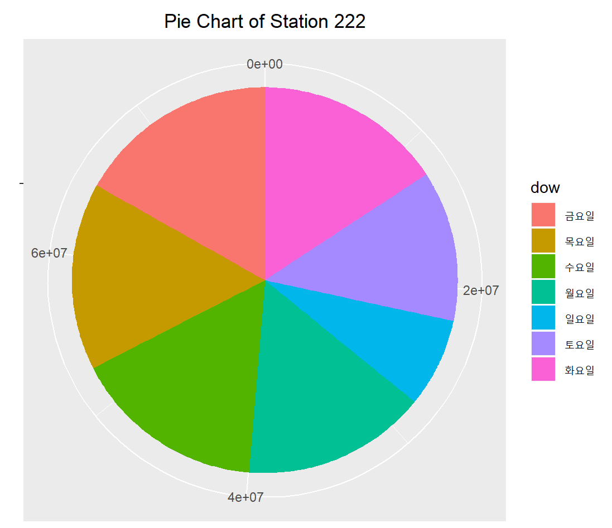
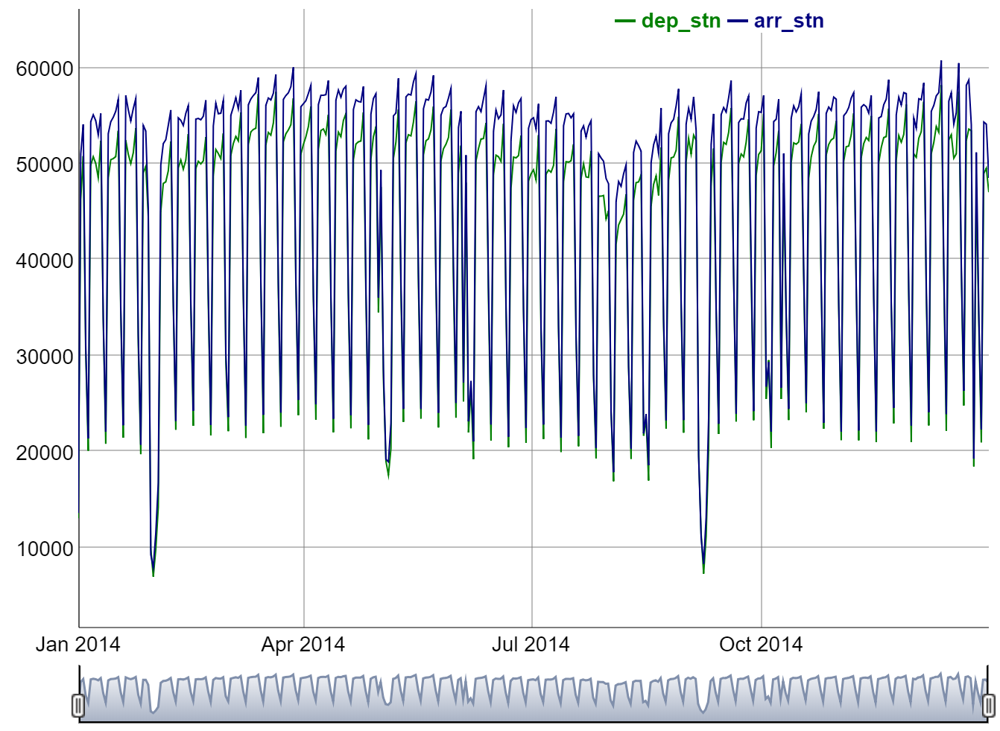

```{r setup, include=FALSE}
knitr::opts_chunk$set(echo = TRUE)
library(dplyr)
library(tidyr)
library(plotly)
Sys.setenv(LANG = "kr")
Sys.setlocale("LC_ALL", "Korean")
```

## I. 불러오기  

```{r}
dataset <- read.csv("dataset_subway_daily.csv", stringsAsFactors = FALSE)  
head(dataset)
sapply(dataset, class)
dataset$Date   <- dataset$Date %>% as.Date()
dataset$dow    <- dataset$Date %>% weekdays() %>% as.factor()
dataset$depArr <- dataset$depArr %>% as.factor() 
head(dataset)
```

## II. Quiz

#### 1. (`dplyr`) 2호선 역중에서 2014년 1년간 가장 승하차인원의 합이 많았던 역과 적었던 역 10개를 각각 찾아주세요.  

```{r}
# 1)
# 
#
```

  

```{r}
# 2) 
#
#
```

  

#### 2. (`ggplot2`) 강남역의 요일별 이용승객수에 대해서 `boxplot`을 그려주세요.  

```{r}
#
#
#
```

  

#### 3. (`ggplot2`) 강남역의 요일별 이용승객수에 대해서 piechart를 그려주세요.

```{r}
#
#
#
```

  

#### 4. (`dygraph`) 양재역의 승차인원과 하차인원에 대해서 각각 시계열 차트를 그려주세요.  신분당선의 강남-신사 구간이 2022년 1월에 연장 개통된다고 합니다.  

```{r, message = FALSE}
#
#
#
```




