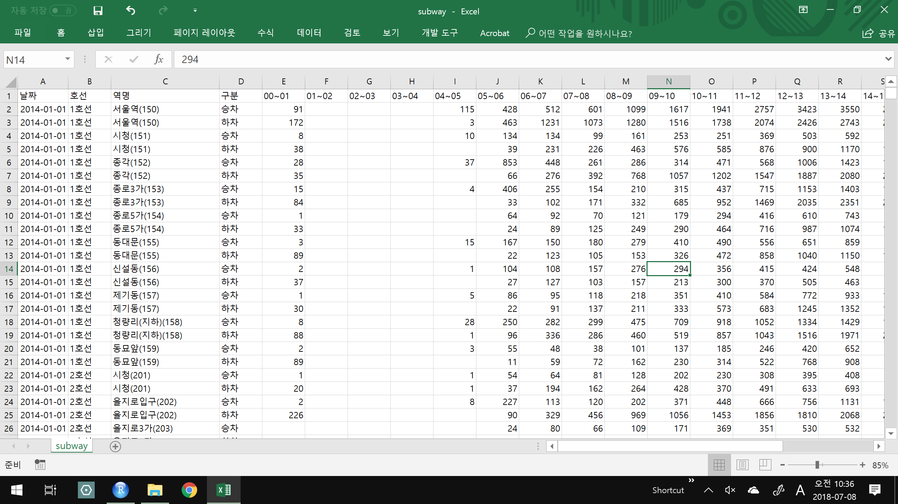

```{r setup, include=FALSE}
knitr::opts_chunk$set(echo = TRUE)
library(dplyr)
Sys.setenv(LANG = "kr")
Sys.setlocale("LC_ALL", "Korean")
```

## I. 불러오기  

\  

```{r}
raw <- read.csv("subway.csv", stringsAsFactors = FALSE)  
```
  
```{r}
str(raw)
head(raw)
dim(raw)
colnames(raw) <- c("Date", "Line", "Stn", "UD", 0:23)
raw$Date <- as.Date(raw$Date)
splitNameCode <- function(x) {
  nameCode    <- strsplit(x, split = "[(]") %>% unlist()
  nameCode[2] <- substr(nameCode[2], 1, nchar(nameCode[2])-1)
  return(nameCode)
}
a  <- sapply(raw$Stn, splitNameCode) 
raw$Name <- lapply(a, function(x) x[1]) %>% unlist()
raw$Code <- lapply(a, function(x) x[2]) %>% unlist()

```


## R Markdown

This is an R Markdown document. Markdown is a simple formatting syntax for authoring HTML, PDF, and MS Word documents. For more details on using R Markdown see <http://rmarkdown.rstudio.com>.

When you click the **Knit** button a document will be generated that includes both content as well as the output of any embedded R code chunks within the document. You can embed an R code chunk like this:

```{r cars}
summary(cars)
```

## Including Plots

You can also embed plots, for example:

```{r pressure, echo=FALSE}
plot(pressure)
```

Note that the `echo = FALSE` parameter was added to the code chunk to prevent printing of the R code that generated the plot.
