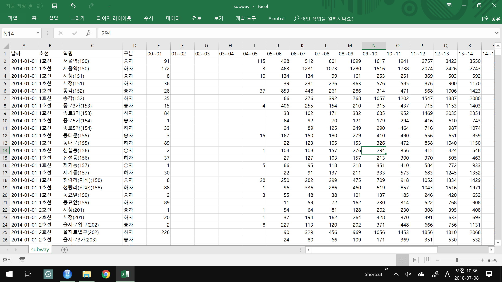
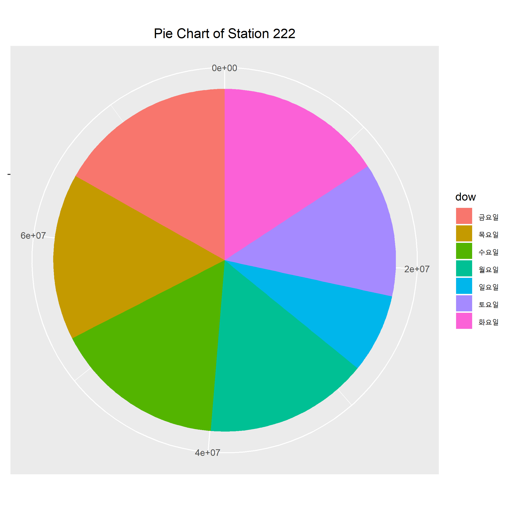
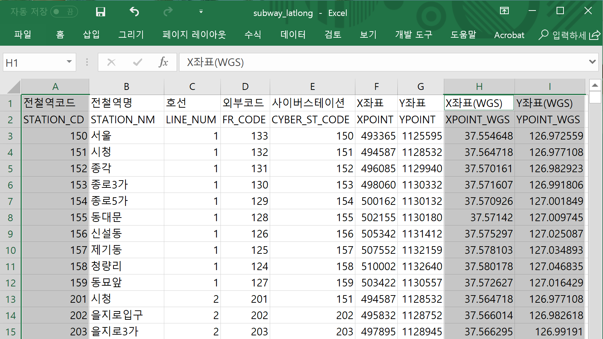
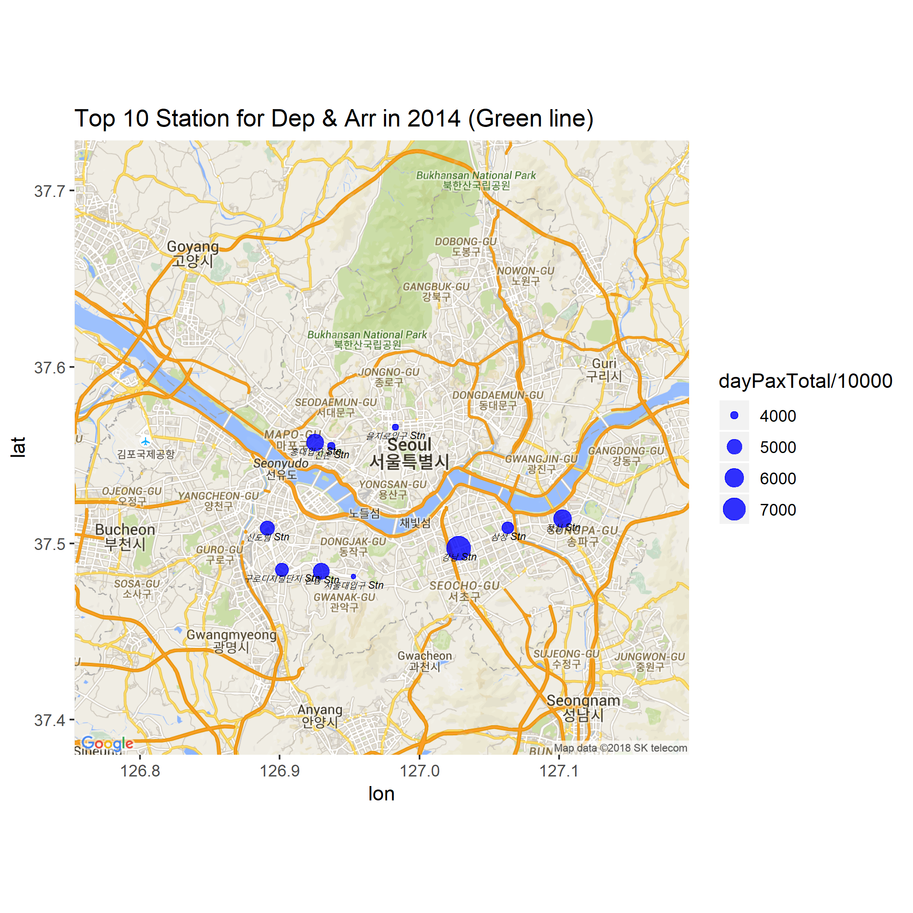

---
title: "M44-subway (`tidyr` + `ggmap`) "  
author: "LearningSpoonsR "
date: "`r Sys.Date()`"  
fontsize: 9pt  
output:  
  beamer_presentation:  
    theme: "Singapore"   
    # For code line number, choose among   
    # ["Antibes", "Montpellier", "Singapore", "Szeged"]  
    colortheme: "beaver"   
    # For Singapore - ["beaver": print-friendly, "beetle": grey]  
    latex_engine: xelatex  
    # keep_tex: true  
    # template: myTemplate.tex  
    includes:  
      in_header: myRmdBeamerStyle/latex-topmatter.tex  
classoption: t  
mainfont: NanumGothic  
---  

```{r setup, include=FALSE}
library(rmarkdown)
knitr::opts_chunk$set(echo = TRUE)
knitr::opts_chunk$set(background = '718CBA')
source("../../LSR.R")
library(dplyr)
library(tidyr)
library(ggplot2)
```

## I. 불러오기       

\  

\vspace{5pt}

```{r}
raw <- read.csv("raw_subway.csv", stringsAsFactors = FALSE)  
```

## II. 전처리

\lc  

`UD`는 승차와 하차를 구분하는 변수의 이름입니다.  

\vspace{5pt}

```{r}
colnames(raw) <- 
  c("Date", "Line", "Stn", "UD", 
    paste0("V", 0:23)) 
```

\rc  

`Stn`에서 역이름을 나타내는 `Name`변수와 `Code`변수로 분리합니다.  

\vspace{5pt}

```{r}
raw$Name <- 
  substr(raw$Stn, 
         start = 1,                
         stop = nchar(raw$Stn)-5)
raw$Code <- 
  substr(raw$Stn, 
         start = nchar(raw$Stn)-3, 
         stop = nchar(raw$Stn)-1) %>% 
  as.numeric()
```

\ec

##  

+ 저는 항상 `raw` 데이터셋에서 시작하여 tidy한 `data.frame`을 만들면 그것에 이름을 `dataset`라고 붙여줍니다. \br   
+ 여러분도 각자의 규칙과 convention을 만들어 보세요. 

\vspace{10pt}

1) `Line`변수를 제거합니다. (`Code`의 맨 앞자리 숫자가 `Line`과 같으므로 `Line`은 필요없다 판단해서 제거)  \br
1) `Stn`변수는 이미 `Name`변수와 `Code`변수를 만들어 냈으므로 제거합니다.  \br 
2) 오전 1시- 오전 4시까지의 관찰값을 제외합니다.  

\vspace{5pt}

```{r}
raw <- raw %>% 
  select(-c(Line, Stn)) %>%  # 1) remove `Line` and `Stn`
  select(-c(V1, V2, V3))     # 2) remove `V1`, `V2`, `V3` 
```

3) 4시-23시 사이에 빈 값이 있는 경우에 0으로 채웁니다.  

\vspace{5pt}

```{r}
# 3) fill NA with zero for `V0`, `V4-V23`
for (V in c("V0", paste0("V", 4:23))) {
  x <- raw[,V] 
  x[is.na(x)] <- 0
  raw[,V] <- x
}
```

##

+ 4) `tidyr`의 `gather`명령을 이용해서 raw를 `tidy`하게 바꿉니다! (`M51-tidyr` 참조) \br
+ 5) `UD`로 `depArr`라는 변수를 만들어서 승차와 하차를 구분합니다.  \br
+ 6) 시간을 숫자로 바꿉니다. \br
+ 7) `raw`가 잘 정리되어 이제 `dataset`이라는 명예로운 이름을 붙여줍니다. (저의 convention으로는 이것은 전처리 과정이 끝난 것을 의미합니다.)  

```{r}
# 4) `gather` in `table4a` in `M51`
raw <- raw %>%
  gather(colnames(raw)[3:23], key = "hour", value = "pax")
# 5) define `depArr` from `UD`, and kill `UD`
raw <- raw %>%
  mutate(depArr = ifelse(UD == "승차", "dep", "arr")) %>%
  select(-UD)
# 6) make hour to number
raw$hour <- substr(raw$hour, 2, nchar(raw$hour)) %>% as.numeric
# 7) rearrange `raw` and now we have tidy `dataset`
dataset <- raw %>% 
  select(Date, Code, Name, hour, depArr, pax) %>%
  arrange(Date, Code, Name, hour, depArr, pax)
```

##

+ 데이터셋의 크기 관계로 수업 시간에 적합할 수준인 일별로 집계합니다.  \br
+ `raw`에서 `dataset`으로 만드는 과정의 프로그램 실행은 오래걸리는 경우가 많습니다. \br
+ 그러므로 `dataset`을 잘 저장해두고 이후의 분석 코드에서는 `dataset`을 불러오면서 분석을 시행하는 것이 좋습니다.

\vspace{10pt}  

```{r}
dataset <- dataset %>%
  group_by(Date, Code, Name, depArr) %>% summarise(dayPax = sum(pax)) 
head(dataset)
write.csv(dataset, "dataset_subway_daily.csv")
```

\vspace{5pt}  

```{r}
# dataset <- read.csv("dataset_subway_daily.csv", stringsAsFactors = FALSE) 
dataset$Date   <- dataset$Date %>% as.Date()
dataset$dow    <- dataset$Date %>% weekdays() %>% as.factor()
dataset$depArr <- dataset$depArr %>% as.factor() 
```

## III. 간단한 분석  

#### 복습의 의미로 아래의 Task를 해보겠습니다.  

#### Task 1. (`dplyr`) 2호선 역중에서 2014년 1년간 가장 승하차인원의 합이 많았던 역과 적었던 역 10개를 각각 찾아주세요.  

#### Task 2. (`ggplot2`) 강남역의 요일별 이용승객수에 대해서 `boxplot`을 그려주세요.  

#### Task 3. (`ggplot2`) 강남역의 요일별 이용승객수에 대해서 piechart를 그려주세요.  

#### Task 4. (`dygraph`) 양재역의 승차인원과 하차인원에 대해서 각각 시계열 차트를 그려주세요.  신분당선의 강남-신사 구간이 2022년 1월에 연장 개통된다고 합니다.   

## III - Task 1  

**Task 1. (`dplyr`) 2호선 역중에서 2014년 1년간 가장 승하차인원의 합이 많았던 역과 적었던 역 10개를 각각 찾아주세요.**  

\vspace{10pt}  

```{r}
# 1)
task1_1 <- dataset %>% 
  filter(substr(Code, 1, 1)==2) %>%
  group_by(Code, Name) %>% summarise(dayPaxTotal = sum(dayPax)) %>%
  arrange(desc(dayPaxTotal)) %>% head(10)
task1_1
```

##   

```{r}
# 2) 
task1_2 <- dataset %>% 
  filter(substr(Code, 1, 1)==2) %>%
  group_by(Code, Name) %>% summarise(dayPaxTotal = sum(dayPax)) %>%
  arrange(desc(dayPaxTotal)) %>% tail(10)
task1_2
```

## III - Task 2  

**2. (`ggplot2`) 강남역의 요일별 이용승객수에 대해서 `boxplot`을 그려주세요.**  

\vspace{10pt}  

```{r, warning = FALSE, fig.width = 3, fig.height = 2}
dataset2 <- dataset %>% 
  filter(Code == 222) %>%
  group_by(Date, dow) %>% summarise(dayPaxTotal = sum(dayPax))
library(ggplot2)
a <- ggplot(dataset2) + geom_boxplot(aes(x = dow, y = dayPaxTotal)) +
  coord_flip()
ggsave(filename="task2.png", plot=a)  
```

\  


## III - Task 3   
 
**3. (`ggplot2`) 강남역의 요일별 이용승객수에 대해서 piechart를 그려주세요.**   

\vspace{10pt}  

```{r, warning = FALSE, fig.width = 3, fig.height = 2}
a <- ggplot(dataset2, aes(x = "", y = dayPaxTotal, fill = factor(dow))) + 
  geom_bar(width = 1, stat = "identity") +
  theme(axis.line = element_blank(),
        plot.title = element_text(hjust = 0.5)) +
  labs(fill = "dow", x = NULL, y = NULL, title = "Pie Chart of Station 222") +
  coord_polar(theta = "y", start = 0)
ggsave(filename="task3.png", plot=a)
```

##  

\   


## III - Task 4  

**4. (`dygraph`) 양재역의 승차인원과 하차인원에 대해서 각각 시계열 차트를 그려주세요.  신분당선의 강남-신사 구간이 2022년 1월에 연장 개통된다고 합니다.**

\vspace{5pt}

\lc 

```{r, message = FALSE, warning = FALSE, results = 'hide'}
stn <- dataset %>% 
  filter(Name == "양재") %>%
  select(Date, Code, Name, depArr, dayPax)
library(xts)
library(dygraphs)
setLang("kr")
dep_stn <- stn %>% filter(depArr=="dep")
arr_stn <- stn %>% filter(depArr=="arr")
time_index <- stn %>% filter(depArr=="arr")
time_index <- time_index$Date
stn_xts <- xts(
  cbind(dep_stn$dayPax, arr_stn$dayPax), 
  order.by = time_index)
colnames(stn_xts) <- c("dep_stn", "arr_stn")
dygraph(stn_xts) %>% dyRangeSelector() 
```

\rc 

```{r}
head(stn_xts)
```

\ec

##  

## IV. 지도 표시를 위한 준비  

#### 1. 위치 정보 불러오기  

\vspace{5pt}

\  

\vspace{5pt}

```{r}
lat_lon <- read.csv("subway_latlong.csv", header = TRUE, skip = 1) %>%
  select(STATION_CD, STATION_NM, XPOINT_WGS, YPOINT_WGS) 
```

##  

```{r}
head(lat_lon)
```

##  

#### 2. 지도 불러오기 (서울)   

\vspace{5pt}

```{r}
library(ggmap)
seoul_map <- get_map(
  location= c(lon= 126.9726, lat= 37.55465), 
  zoom= 11, 
  maptype= "roadmap")
seoul_map <- ggmap(seoul_map)
```

##  

```{r}
print(seoul_map)
```

## V. 지도에 표시  

**승객많은 역 10개 (`task1_1`) 와 위치 정보(`lat_lon`)과를 결합하기 (참조: `M51` join 부분)**  

\vspace{5pt}

```{r}
map10 <- 
  left_join(x = task1_1, y = lat_lon, by = c("Code"="STATION_CD")) %>%
  select(-STATION_NM)
head(map10)
```

##  

**지도위에 Bubble Chart**  

\vspace{5pt}

```{r}
a <- seoul_map +
  # https://ggplot2.tidyverse.org/reference/geom_point.html
  geom_point(data = map10, 
             aes(x = YPOINT_WGS, y = XPOINT_WGS, 
                 size = dayPaxTotal/10000),
             color = "blue", alpha = 0.8) + 
  # https://ggplot2.tidyverse.org/reference/geom_text.html
  geom_text(data = map10,
            aes(x = YPOINT_WGS, y = XPOINT_WGS, 
                label = paste(Name, "Stn"), 
                fontface = "italic",
                vjust = 1.5), 
            size = 2) +
  labs(title = "Top 10 Station for Dep & Arr in 2014 (Green line)")
ggsave(filename="map.png", plot=a)
```

##    

\   


