---
title: "M46 - how to share your shiny apps"  
author: "LearningSpoonsR "
date: "`r Sys.Date()`"  
fontsize: 9pt  
output:  
  beamer_presentation:  
    theme: "Singapore"   
    # For code line number, choose among   
    # ["Antibes", "Montpellier", "Singapore", "Szeged"]  
    colortheme: "beaver"   
    # For Singapore - ["beaver": print-friendly, "beetle": grey]  
    latex_engine: xelatex  
    # keep_tex: true  
    # template: myTemplate.tex  
    includes:  
      in_header: myRmdBeamerStyle/latex-topmatter.tex  
classoption: t  
mainfont: NanumGothic  
---  

```{r setup, include=FALSE}
library(rmarkdown)
knitr::opts_chunk$set(echo = TRUE)
knitr::opts_chunk$set(background = '718CBA')
source("../../LSR.R")
library(dplyr)
library(tidyr)
library(ggplot2)
```

## 공유를 위한 Shiny 코드 작성  

+ 헤더 부분에서 `source: embed`라는 옵션을 넣어주어야 share가 가능합니다. \br
+ 헤더 부분에서는 띄어쓰기와 indent가 모두 정확해야 합니다. \br
+ (indent(들여쓰기)의 단위는 더블 스페이스이며 이는 다른 rmd의 헤더에도 똑같이 적용됩니다. (띄어쓰기 두번))  
+ 관련된 모든 파일의 제목과 내용, 그리고 shiny 출력물이 모두 영어로만 되어있어야 함.  \br
+ Shiny code에 해당하는 `.Rmd`에서 불러오는 데이터 파일이나 소스코드는 sub-directory에 넣어두어야 함. \br
+ (예를 들어 `/data` 폴더를 만들어서 데이터 파일을 저장하고 `/source` 폴더를 만들어서 함수등의 소스 코드를 저장) \br  
+ 문제 생기면 연락주세요!!  

## 코드 (1/2)

+ 헤더 부분 주의!!  

\begin{center}
\includegraphics[width=0.8\textwidth]{fig/fig_code1.png}
\end{center}

## 코드 (2/2)    

+ Editor창 왼쪽의 Line 번호에서 접어주기 기능을 사용하면 긴 코드도 요약해서 볼 수 있습니다. \br

\begin{center}
\includegraphics[width=0.7\textwidth]{fig/fig_code2.png}
\end{center} 

## 공유     

+ <https://shiny.rstudio.com/tutorial/written-tutorial/lesson7/>  \br
+ 여러가지 옵션이 있지만 `Shinyappos.io`에 공유합니다.  

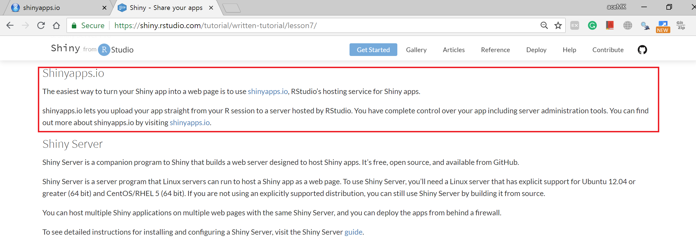\  

##  

+ <http://www.shinyapps.io>에서 회원 가입 및 로그인  

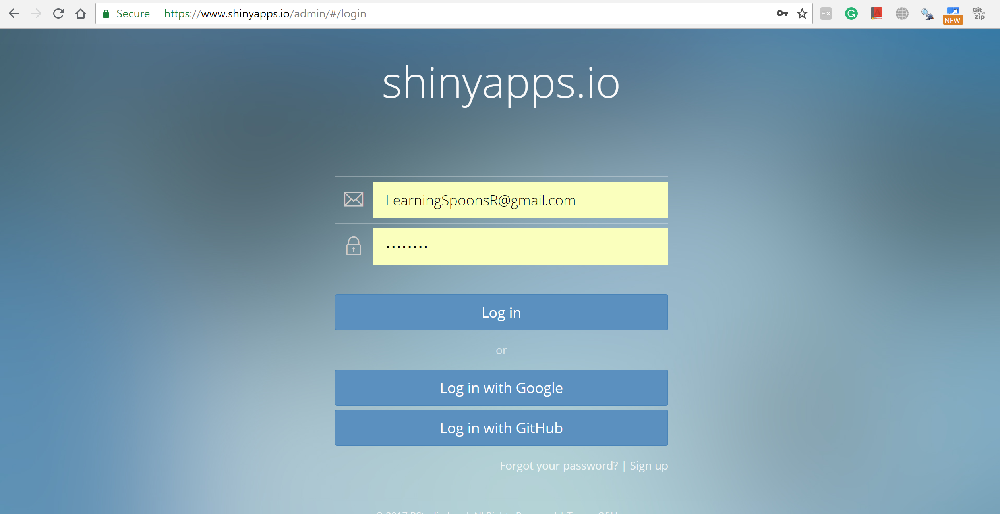\  

##   

+ Run Document를 하여 Shiny를 실행 \br
+ 오른쪽 위의 "Publish" 메뉴에서 "Manage Account"

\  

##   

+ "Connect" 버튼을 눌러서 계정 정보를 Rstudio에 입력시킴 \br

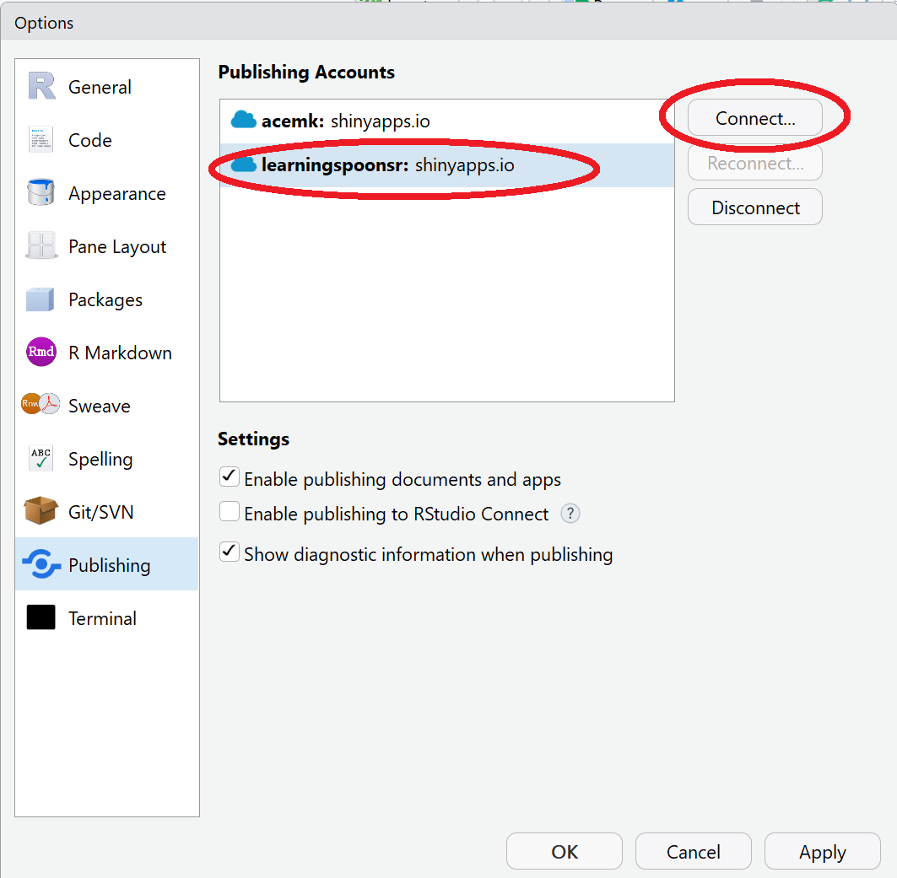\  

##  

+ 현재 팝업 윈도우의 과정을 모두 따라가면 계정 정보가 Rstudio에 연결이 됨 \br

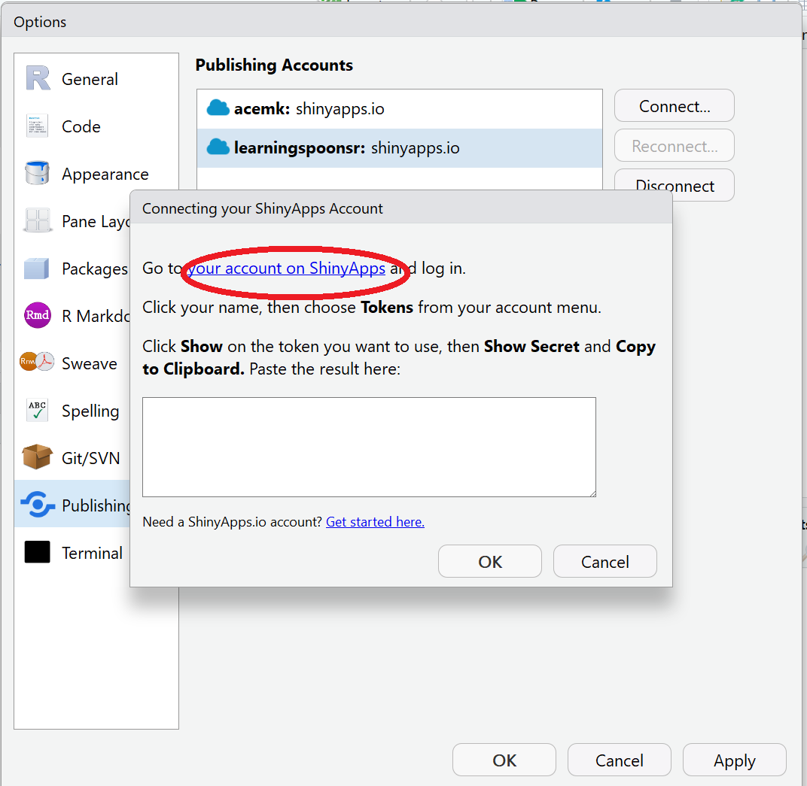\  

##   

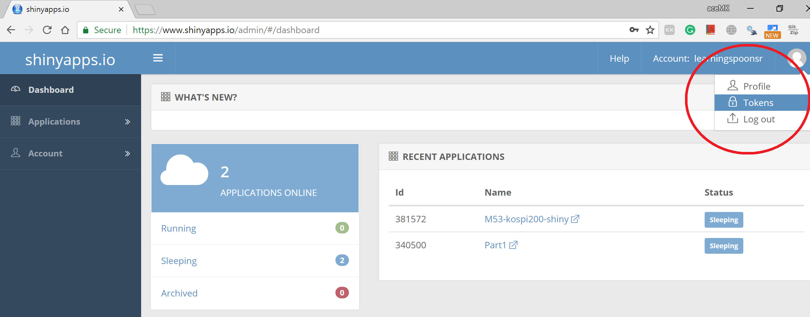\  

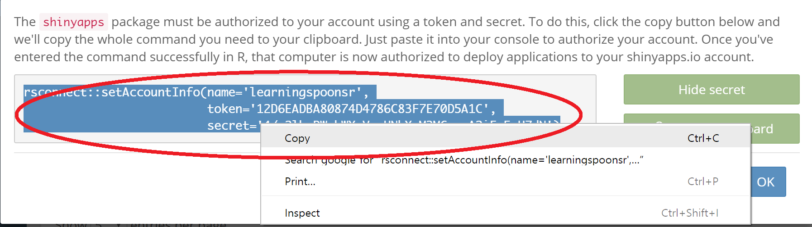\  

##  

+ 연결 완료!  

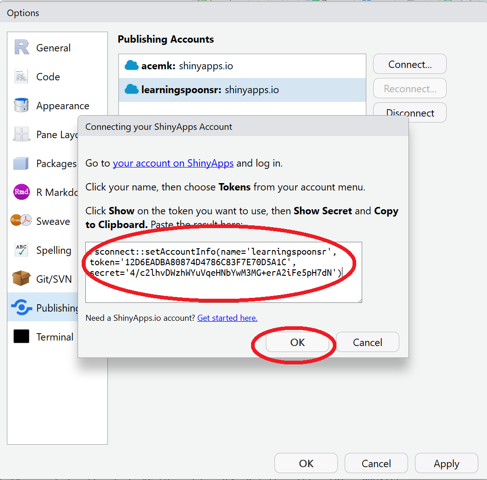\  

##  

+ 계정 연결이 되었으므로 "Publish Document"를 실행  

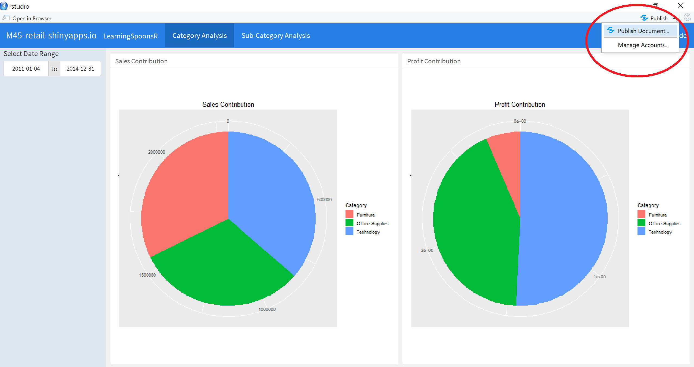\  

##  

+ Rstudio에서 "Deploy" 탭이 뜨면서 서버에 업로드가 진행됨  

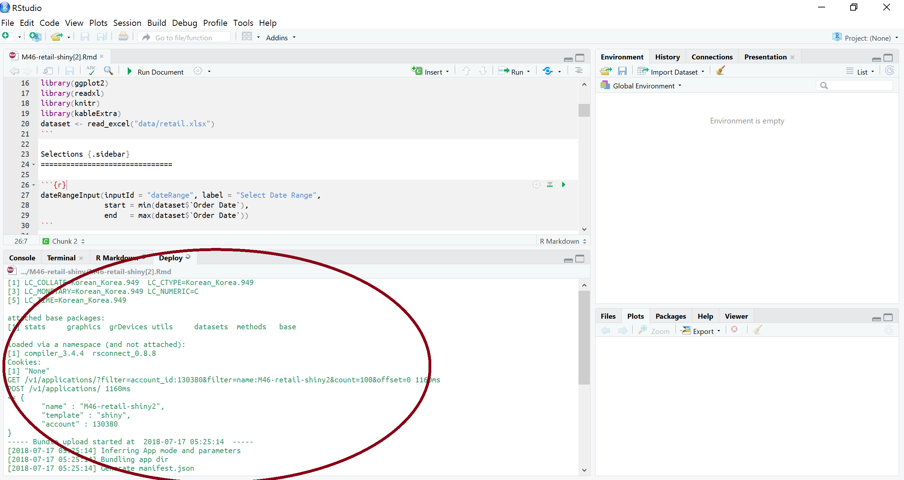\  

##  

+ 업로드된 앱은 인터넷 브라우저로 누구나 접속이 가능함   

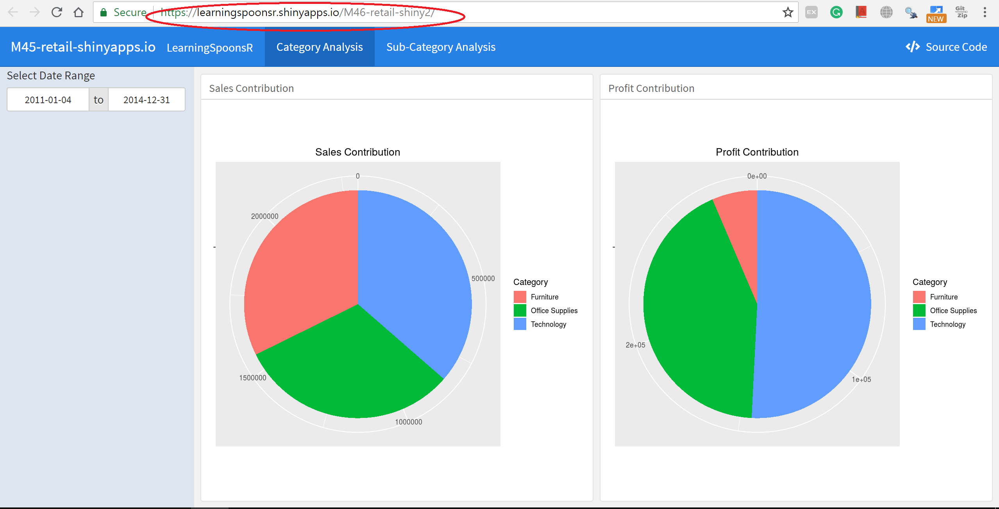\  

##  

+ shinyapps.io를 방문하면 현재 계정에서 업로드한 앱들의 정보를 볼 수 있음  

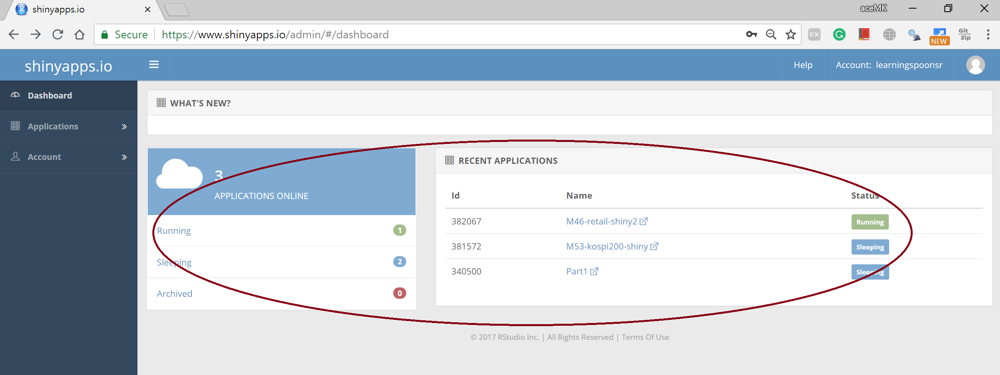\  

##  

+ 서버에 올려진 `M46` 샤이니 앱에 대한 정보  

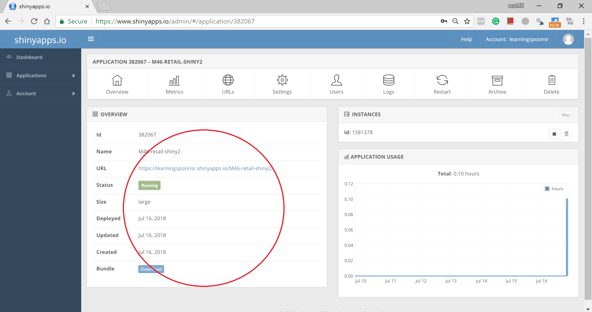\  

```{r}
"Thank you"
```  

